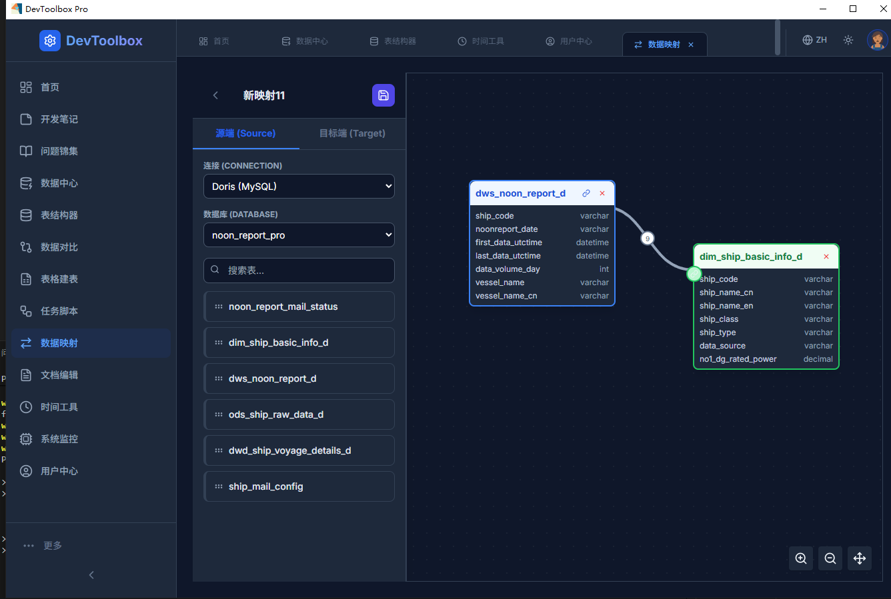
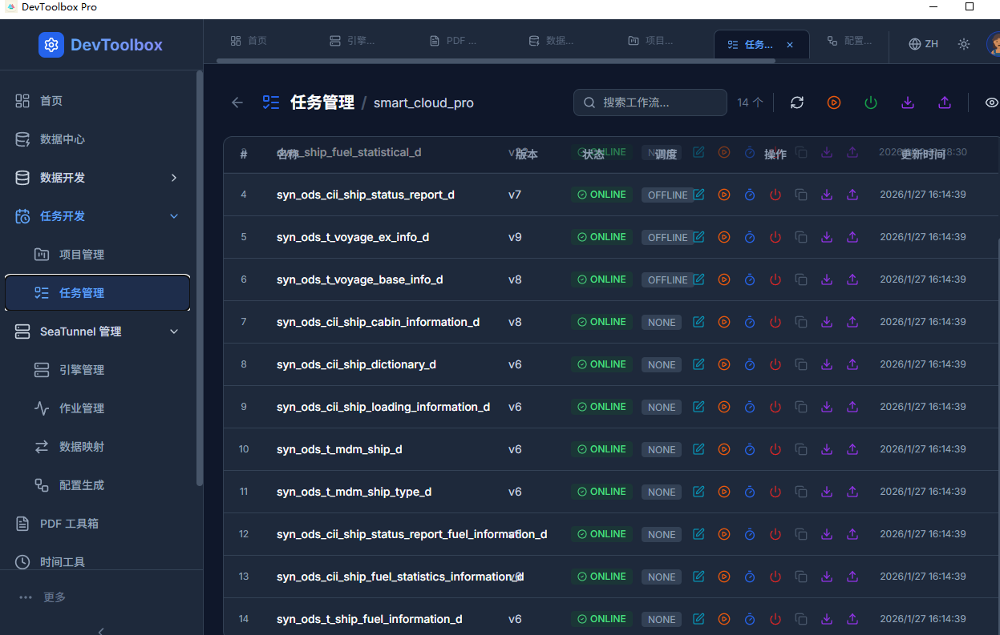
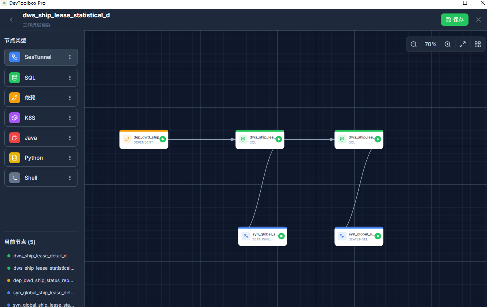
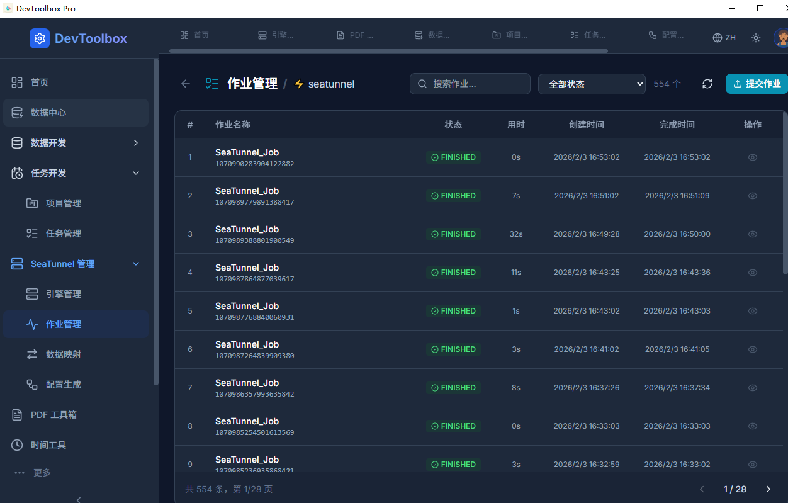
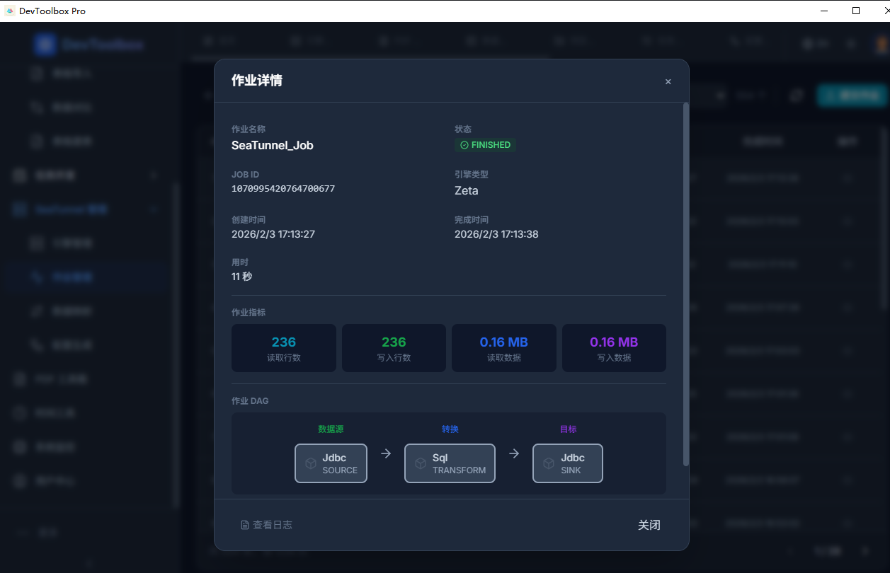
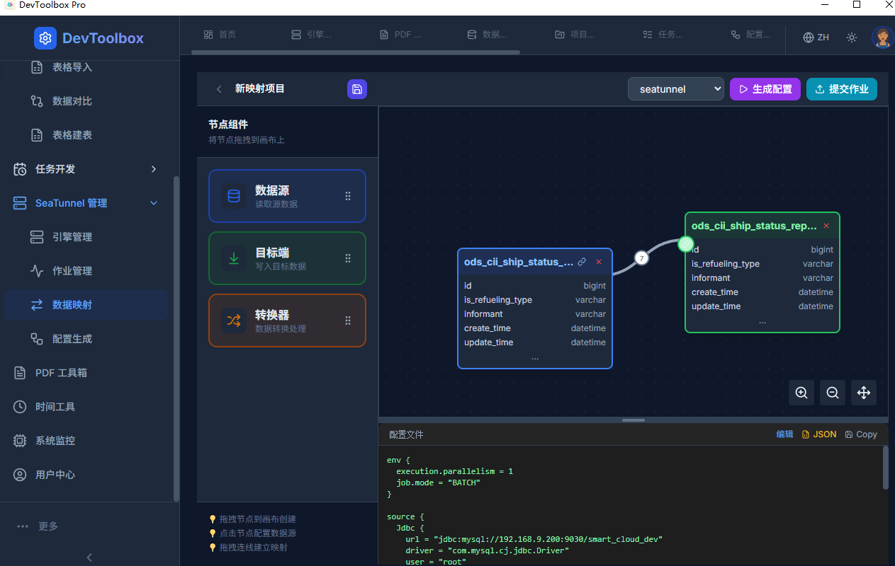

# DevToolbox Pro - 开发者全能工具箱

DevToolbox Pro 是一个基于 **Tauri 2.0** + **React 19** + **Rust** 构建的跨平台桌面应用。集成数据库管理、数据同步脚本生成、办公工具和系统监控等功能。


## 📸 功能预览

| 数据源管理 | 数据库查看 |
| :---: | :---: |
|  |  |

| PDF工具箱 | 时间戳工具 |
| :---: | :---: |
|  |  |

| SeaTunnel 脚本生成 | 系统监控 |
| :---: | :---: |
|  |  |

| DolphinScheduler 管理 | 工作流编辑 |
| :---: | :---: |
|  |  |

| SeaTunnel 任务管理 |
| :---: |
|  |

## 🛠️ 技术栈

| 类型 | 技术 |
| --- | --- |
| 前端 | React 19, TypeScript, Tailwind CSS |
| 后端 | Rust, Tauri 2.0 |
| 构建 | Vite |

### 第三方系统版本

| 系统 | 版本 | 备注 |
| --- | --- | --- |
| **DolphinScheduler** | 3.2.2 | 工作流调度管理 |
| **SeaTunnel** | 2.3.8 | 需开启 REST API |

## ✨ 核心功能

- **数据库查看器** - 支持 MySQL, Doris, PostgreSQL 多数据源
- **SeaTunnel 脚本生成** - 可视化配置 Source/Sink
- **DolphinScheduler 管理** - 工作流可视化编辑和运行
- **SeaTunnel 管理** - 任务提交与监控
- **PDF 工具箱** - 合并、拆分、压缩
- **时间戳工具** - 多格式转换，支持多时区
- **系统监控** - 实时 CPU/内存监控
- **自动更新** - 应用启动时自动检查新版本

---

## 🚀 快速开始

```bash
# 安装依赖
npm install

# 开发模式
npm run tauri dev

# 打包
npm run tauri build
```

---

## 📄 License

MIT License