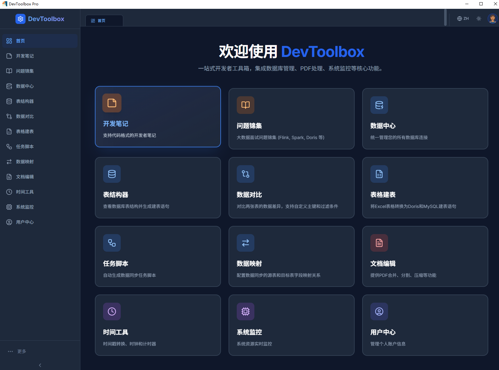
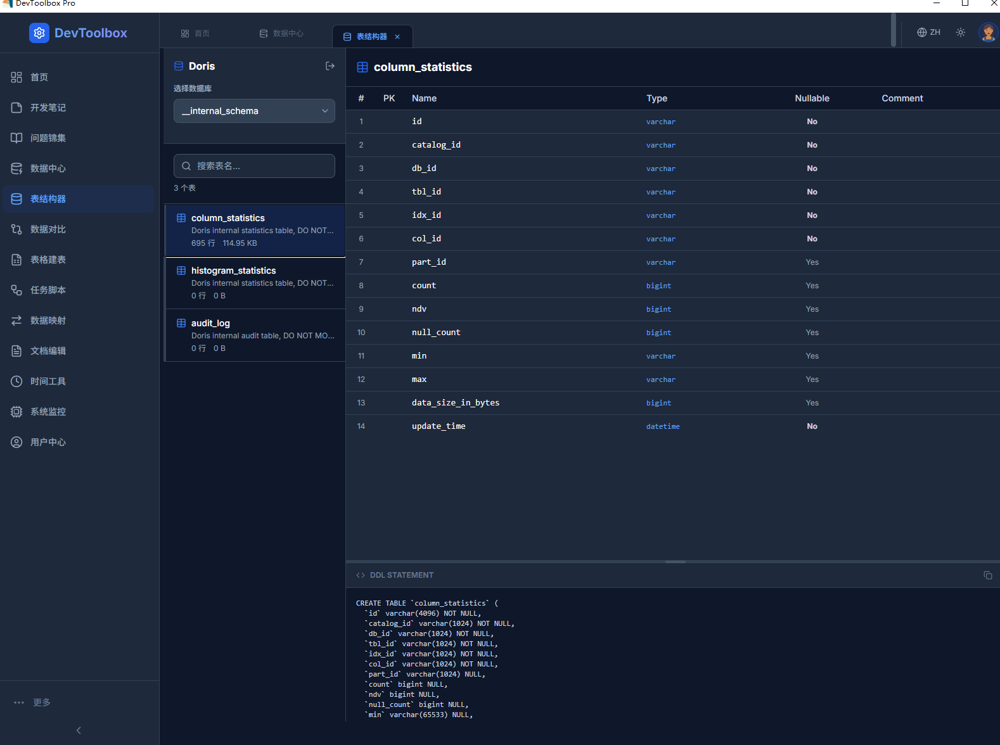
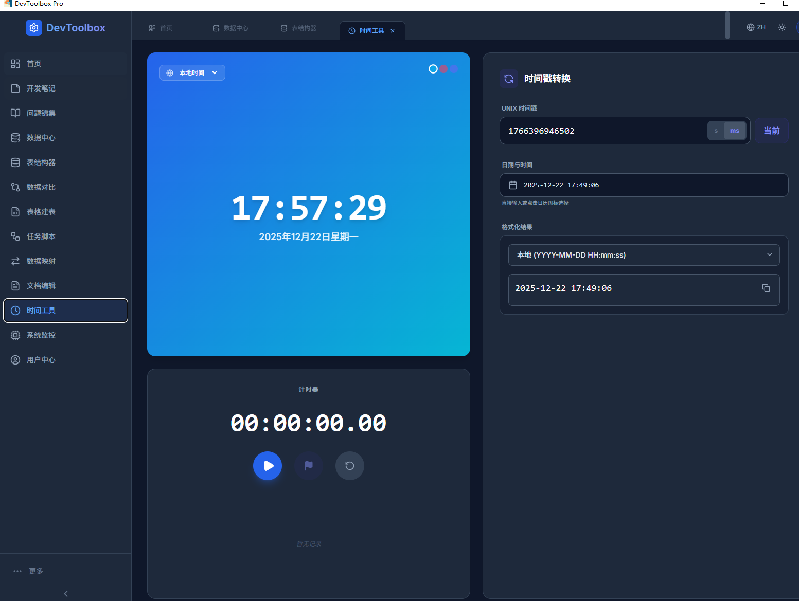
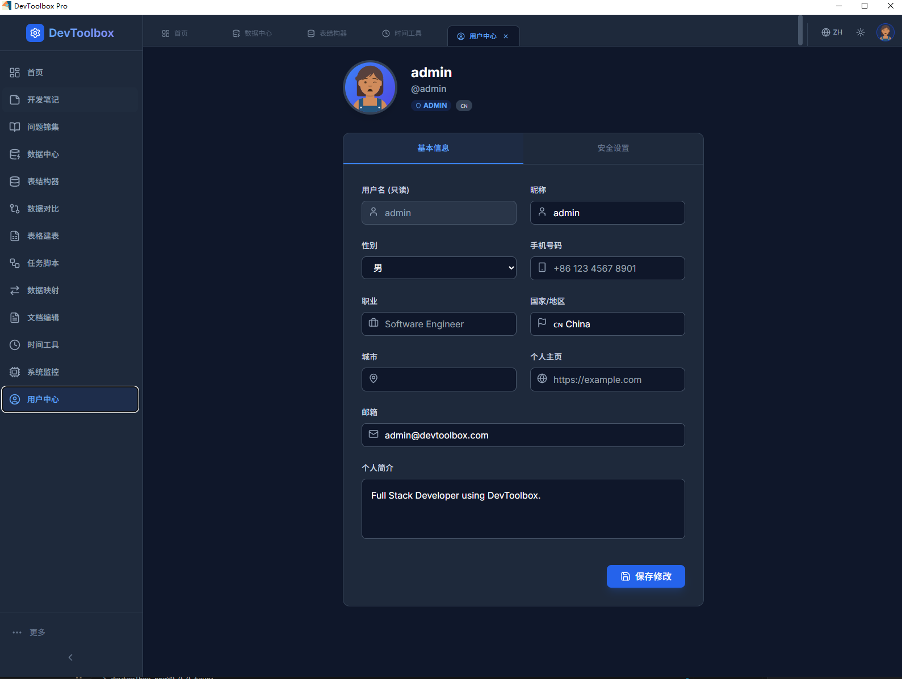

# DevToolbox Pro - The Ultimate Developer's Toolkit

DevToolbox Pro is a cross-platform desktop application built with **Tauri 2.0**, **React 19**, and **Rust**. It integrates database management, data synchronization scripting, office utilities, and system monitoring, designed specifically for developers with high performance and a small footprint.



## 📸 Screenshots

| Datasource Manager | Database Viewer |
| :---: | :---: |
|  |  |

| PDF Toolkit |
| :---: |
|  |

## 🛠️ Tech Stack

*   **Frontend**: React 19, TypeScript, Tailwind CSS, Lucide Icons, Recharts
*   **State Management**: Zustand (Lightweight global state)
*   **Backend**: Rust (Tauri Host Process)
*   **Framework**: Tauri 2.0
*   **Build Tool**: Vite

## 🏗️ Architecture

*   **Feature-Based**: Modular design for easy extension
*   **Zustand Stores**: 9 dedicated stores for unified state management
*   **TypeScript**: Complete type safety
*   **Atomic Components**: Highly reusable component design
*   **Performance**: Fine-grained updates via Selectors
*   **Responsive**: Adaptive to different screen sizes
*   **Hot Reload**: Automatic refresh for both frontend and backend changes

## ✨ Core Features

1.  **Database Viewer**: visualization of table structures for MySQL, Doris, PostgreSQL, etc. Supports DDL/DML generation and dialect conversion.
2.  **Excel to SQL**: Parse Excel files and automatically generate table creation statements with custom template rules.
3.  **Seatunnel Script Generator**: Visual configuration for Source/Sink, task management, and one-click generation of Seatunnel/DataX scripts.
4.  **PDF Toolkit**: Merge, Split, Compress, and View PDF files.
    *   *Merge*: Combine multiple PDFs.
    *   *Split*: Extract pages by range or specific numbers.
    *   *Compress*: Optimize PDF size.
    *   *View*: Built-in PDF viewer.
5.  **System Tools**: Real-time system monitoring (CPU/RAM/Network) and timestamp conversion (multiple formats/timezones).
6.  **Data Comparator**: Compare table structures and data across datasources, visualize differences, and generate sync scripts.
7.  **Field Mapper**: Visual configuration of field mappings between datasources with type compatibility checks.
8.  **Interview Bank**: Collection of developer interview questions with classification and search.
9.  **Notes**: Developer-focused note-taking with Markdown support.
10. **User Management**: Login authentication and profile management.
11. **Datasource Manager**: Centralized management of database connections with import/export support.

---

## 🚀 Getting Started

### 1. Prerequisites
*   **Node.js**: v18.0.0+
*   **Package Manager**: `npm` or `pnpm`
*   **Rust**: Install via [rustup](https://rustup.rs/)

### 2. VS C++ Build Tools (Windows Only)
Download [Visual Studio Build Tools](https://visualstudio.microsoft.com/visual-cpp-build-tools/) and install "Desktop development with C++".

### 3. Installation
```bash
npm install
```

### 4. Development
```bash
# Web Mode (Frontend only)
npm run dev

# Desktop Mode (Full App)
npm run tauri dev
```

### 5. Build
```bash
npm run tauri build
```
The output installer will be in `src-tauri/target/release/bundle/nsis/`.

---

## 📄 License
MIT License
