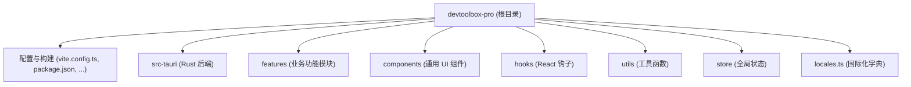

# DevToolbox Pro 项目结构说明文档

本项目是一个基于 **Tauri (Rust)** + **React (TypeScript)** + **Vite** 构建的多功能开发工具箱。

## 1. 核心目录结构 (第一层级)

| 目录/文件 | 描述 | 备注 |
| :--- | :--- | :--- |
| **`src-tauri/`** | **原生后端 (Rust)** | 处理文件系统访问、系统 API 调用、本地数据库交互等。 |
| **`features/`** | **业务逻辑中心** | 按功能拆分的顶级目录，每个子目录代表一个独立工具。 |
| **`components/`** | **全局基础组件** | 按钮、输入框、布局容器、Toast 等。 |
| **`hooks/`** | **复用逻辑** | 封装如 `useTheme`, `useLanguage`, `useAuth` 等逻辑。 |
| **`services/`** | **接口服务层** | 统一管理对外 API 或对 Rust 命令的调用。 |
| **`utils/`** | **纯逻辑工具** | 日期处理、字符串格式化、HTTP 拦截器等。 |
| **`store/`** | **状态管理** | 使用 Zustand 或 Context 管理跨页面共享的数据。 |
| **`locales.ts`** | **国际化资源** | 存放所有界面的中英文对照文本。 |

---

## 2. 界面与功能对应关系

如果您需要查找特定功能的界面代码，请重点关注 `features/` 目录：

### 2.1 DolphinScheduler (调度管理)
- **路径**: `features/DolphinScheduler/`
- **主要文件**:
    - `TaskManager.tsx`: 整个调度管理的主入口，包含工作流、实例、定时、任务四个 Tab 页。
    - `components/TaskEditor.tsx`: 流程图拖拽编辑器核心。
    - `components/*Modal.tsx`: 各种弹出对话框（运行、详情、导出、日志等）。

### 2.2 DataCompare (数据对比)
- **路径**: `features/DataCompare/`
- **主要文件**:
    - `DataCompare.tsx`: 处理两端数据库结果集差异对比的界面。

### 2.3 DbViewer (数据库浏览器)
- **路径**: `features/DbViewer/`
- **主要文件**:
    - `DbViewer.tsx`: 连接管理、元数据浏览及 SQL 查询执行界面。

### 2.4 其他模块
- `SeaTunnelManager/`: Seatunnel 任务管理与脚本生成。

---

## 3. 根目录关键配置文件

- **`index.tsx`**: React 应用挂载点，初始化 i18n 配置。
- **`App.tsx`**: 根组件，定义了侧边栏布局及页面路径切换逻辑。
- **`i18n.ts`**: `i18next` 框架的核心初始化逻辑（现阶段重构重点）。
- **`types.ts`**: 全局 TypeScript 类型契约。
- **`vite.config.ts`**: 前端构建及插件配置。

---

## 4. 结构优化建议 (Roadmap)

> [!TIP]
> 随着项目功能增多，建议进行以下调整以保持代码可维护性：

1. **翻译词条拆分**: 
   将 `locales.ts` 拆分为 `src/locales/zh/*.json`，按模块（common, ds, db）分而治之，避免单文件过大造成合并冲突。
2. **逻辑与视图分离**: 
   将 `TaskManager.tsx` 等大型组件中的复杂数据处理逻辑抽取到独立的 `useTaskManager.ts` hook 中。
3. **统一类型管理**: 
   在 `features/Common/types/` 中建立统一的领域模型，减少重复接口定义。
